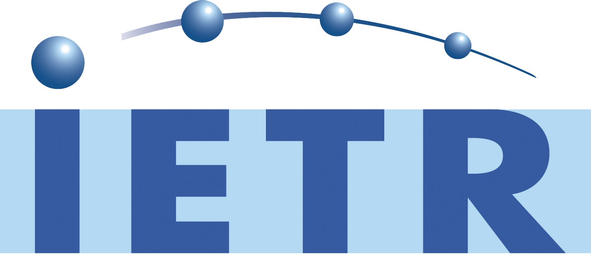

# Project
OpenVVC is open-source real time software decoder compliant with the ITU-T H.266- MPEG-I - Part 3 VVC standard. OpenVVC is developed from scratch in C as a library that provides consumers with real time and energy-aware decoding capabilities under different OS including MAC OS, Windows, Linux and Android targeting low energy real-time decoding of 4K VVC videos on Intel x86 and ARM platforms.

# Supported tools
<table id="toolTable">
<colgroup>
<col width="15%" />
<col width="30%" />
<col width="10%" />
<col width="10%" />
<col width="10%" />
</colgroup>
<thead>
  <tr>
    <th>VVC Tools Category</th>
    <th>VVC Tools</th>
    <th style="text-align: center;">Full support</th>
    <th style="text-align: center;">x86 SIMD</th>
    <th style="text-align: center;">ARM SIMD</th>
  </tr>
</thead>
  <tbody>
    
      <tr>
        
          <td rowspan={{tool.rowspan}}>{{tool.VVC_Tools_category}}</td>
        
        <td >{{tool.VVC_Tools}}</td>
        
          
            <td class="toolok"></td>
          
            <td class="tooloknok"></td>
          
            <td class="toolnok"></td>
          
            <td class="toolna"></td>
        
        
          <td class="toolok"></td>
        
          <td class="tooloknok"></td>
        
          <td class="toolnok"></td>
        
          <td class="toolna"></td>
        
        
          
            <td class="toolok"></td>
          
            <td class="tooloknok"></td>
          
            <td class="toolnok"></td>
          
            <td class="toolna"></td>
        
      </tr>
    
  </tbody>
</table>

# Contributors

  - Pierre-Loup Cabarat
  - Wassim Hamidouche
  - Thomas Amestoy
  - Guillaume Gautier

# Acknowledgements

